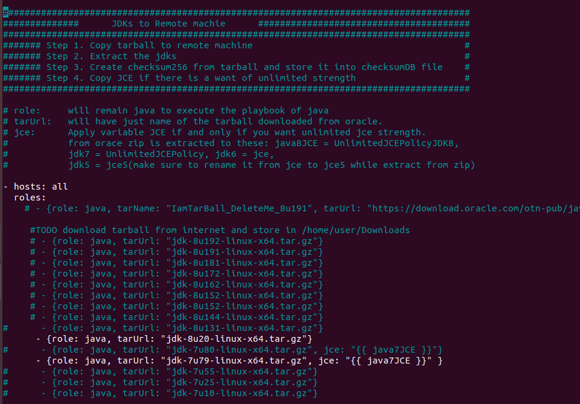
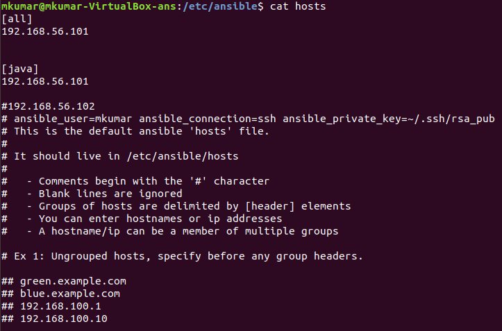
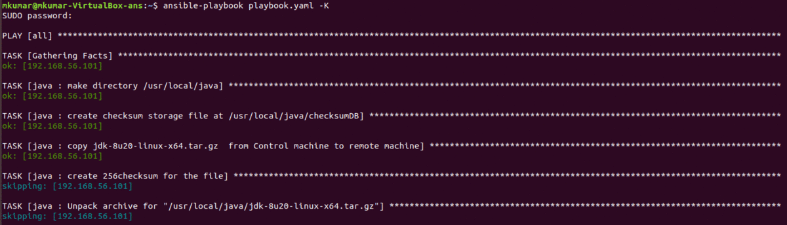
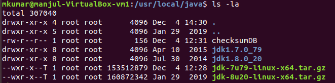
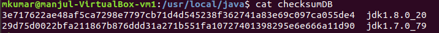

# javaProvisioning
JDKs and/or JCE(Unlimited Strength) from Oracle website to machines defined in the host-inventory file using Ansible.

----

Oracle doesn't allow APIs to download JDKs, so we have to create an account and then manually download JDKs by accepting the license to the local drive at control host(where ansible is installed).

Oracle is notorious with changing urls so please forgive me if these urls are pointing to 404
* [Location of all JDKs-5](https://www.oracle.com/technetwork/java/javasebusiness/downloads/java-archive-downloads-javase5-419410.html), [Location of all JDKs-6](https://www.oracle.com/technetwork/java/javase/downloads/java-archive-downloads-javase6-419409.html), [Location of all JDKs-7](https://www.oracle.com/technetwork/java/javase/downloads/java-archive-downloads-javase7-521261.html) and [Location of all JDKs-8](https://www.oracle.com/technetwork/java/javase/downloads/java-archive-javase8-2177648.html) 

* [Location of Unlimited Strength JCE-5](https://www.oracle.com/technetwork/java/javasebusiness/downloads/java-archive-downloads-java-plat-419418.html), [Location of Unlimited Strength JCE-6](https://www.oracle.com/technetwork/java/embedded/embedded-se/downloads/jce-6-download-429243.html), [Location of Unlimited Strength JCE-7](https://www.oracle.com/technetwork/java/javase/downloads/jce-7-download-432124.html), and [Location of Unlimited Strength JCE-8](https://www.oracle.com/technetwork/java/javase/downloads/jce8-download-2133166.html)

>- Source(control machine) and Destination location(controlled machines) of JDKs should be defined in variables file at **_/group_vars/all.yaml_**
>- Ansible module copies the jdk's tarball from control to controlled machine, make a sha256 for tarball in file named as checksumDB at **_/JDK_Destination/checksumDB_**
>- Unzip the jce and give the location of it in variables file, rename the unzip jce 5's folder to jce5 because jdk 5 and 6 unzip with same folder name, playbooks are designed to read the name of jce 5's as jce5.
>- If **jce** variable is defined in playbook then ansible will provide unlimited strength binaries to that jdk otherwise not.
>- We are not deleting the tarball to make ansible not copy the same jdk tarball again.
<br/>

* [java] = host name for deploying JDK's to IPs given in hosts inventory file. 
           Note: We are executing this playbook on [all] and not [java]
* java = role name for playing included java playbook **_/roles/java/tasks/main.yml_**
* tarURL = name of the tarball downloaded from the web.
* jce = name of the extracted jce unzip file from the web.



* hosts: [java] = hosts name where tasks needs to be performed via playbook **_/etc/ansible/hosts_**

  hosts: all = We are executing this playbook on [all] vms listed at **_/etc/ansible/hosts_**


### The overall structure looks like


and


```
file: playbook.yaml
Directories:
  * roles
  * group_vars
```

# How to run playbook

```
ansible-playbook playbook.yaml -K
```
Where
```-k``` = ask for privilege escalation password.




This is what resulted at Controlled machine(destination machine, where provisioning is done).


checksumDB file at Controlled machine(destination machine, where provisioning is done).
 
